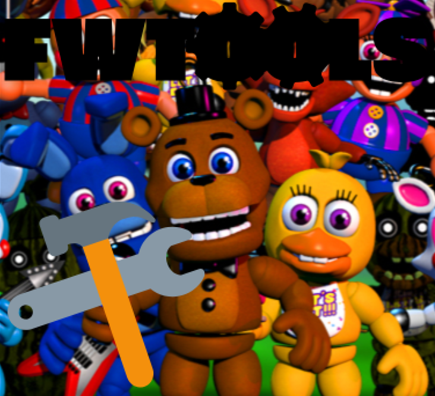

# What is this?
> FWTools is a GUI cheat menu for FNaF World!
>
> Honestly, made just because FNaF World saves (and all FNaF game saves for that matter)
> are basic plaintext, making them easy to modify. Plus it was a good excuse to learn tkinter.

# How are these save files structured?
> Yes, at first glance the saves are confusing since almost everything is shortened down, even to
> single characters.
>
>> ---
>> # File: fnafw(1-3)
>> ### [fnafw]
>> - newgame = creating a new game
>> - mode = game mode (1-adventure 2-fixed party)
>> - diff = difficulty (1-normal 2-hard)
>> - started = have seen first fredbear dialogue (enables continue on title screen)
>> - locked = if in fixed party mode, locks the party selection
>> - cine = fredbear position and next dialogue
>> - tokens = number of faz-tokens
>> - x = x position
>> - y = y position
>> - resetpos = set position to spawn (used on death)
>> - area = (difficulty of) current zone (0-fazbear hills 2-choppys woods 5-dusting fields 8-lilygear lake 11-mysterious mine 14-blacktomb yard 17-deep-metal mine 20-pinwheel circus 23-glitch zone 26-pinwheel funhouse 50-geist lair)
>> - seconds = playtime (seconds)
>> - min = playtime (minutes)
>> - hour = playtime (hours)
>> - sw(1-4) = opened area (1-choppys woods 2-lilygear lake 3-blacktomb yard 4-pinwheel circus)
>> - sw5 = opened key room
>> - sw(6-9) opened gate (6-dusting fields 7-fazbear hills 8-lilygear lake 9-blacktomb yard)
>> - w3 = entered dusting fields
>> - key = have key
>> - find = current clock
>> - g(1-5) = completed clock minigame
>> - s(1-8) = character in slot
>> - ### (x = character)
>> - (x)have = have character
>> - (x)next = character exp (0 is shown as 100)
>> - (x)lv = level minus 1
>> - p(1-21) = purchased byte
>> - active(1-4)b = active byte in slot
>> - c(1-21) = have chip
>> - active(1-4) = active chip in slot
>> - ar(1-3) = have purchased armor or higher armor
>> - armor = current armor strength (0-default 1-reinforced 2-steel 10-titanium)
>> - fish = deedee is gone, catch fish = 1, after 1 min = 0
>> - pearl = number of times the pearl has been caught
>> - beatgame1 = defeated security
>> - last = encountered animdude
>> - beatgame2 = defeated animdude
>> - beatgame3 = defeated chippers revenge
>> - portal = backstage portal
>> - beatgame7 = defeated chicas magic rainbow
>> - showend = in end cutscene
>> ---
>> # File: info
>> ### [info]
>> - first = have seen intro
>> - mode(1-3) = game mode of save
>> - diff(1-3) = difficulty of save
>> - hour(1-3) = playtime (hours) of save
>> - min(1-3) = playtime (minutes) of save
>> - beatgame1 = security trophy
>> - beatgame2 = animdude trophy
>> - beatgame3 = chippers revenge trophy
>> - beatgame6 = universe end trophy
>> - beatgame5 = clock ending trophy
>> - beatgame4 = 4th layer trophy
>> - gotpearl = pearl trophy
>> - all = fan trophy
>> - beatgame7 = chicas magic rainbow trophy
